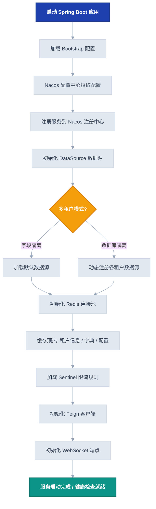
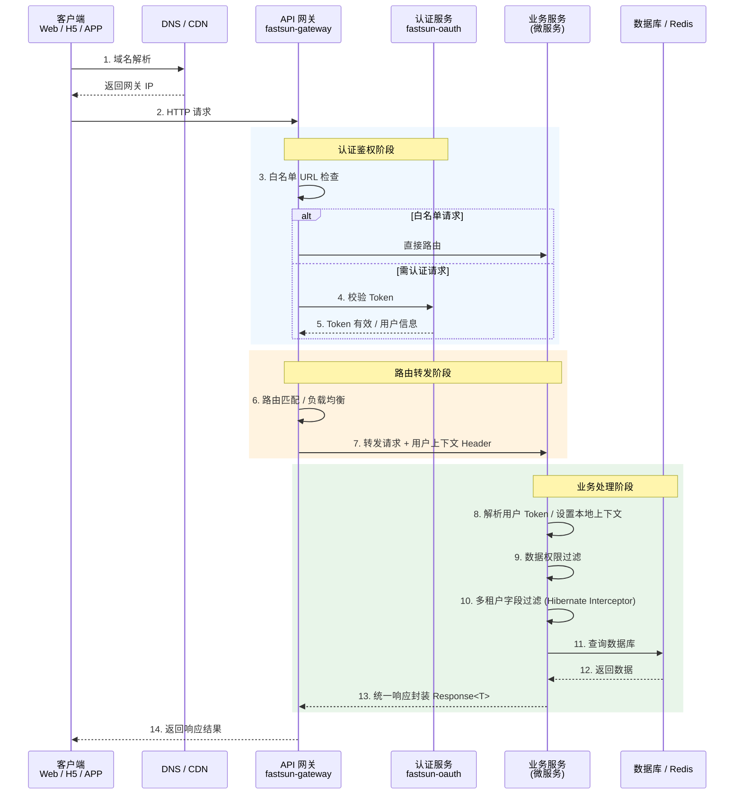
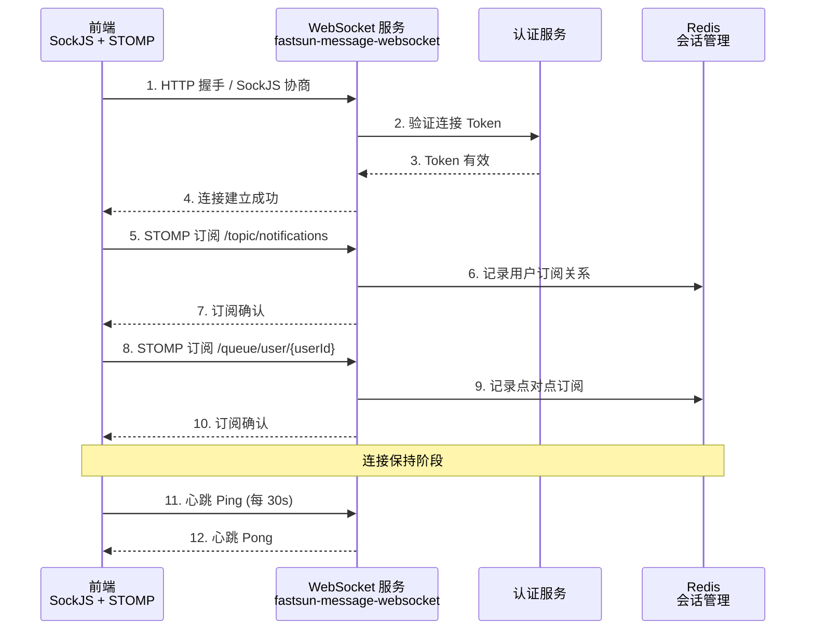
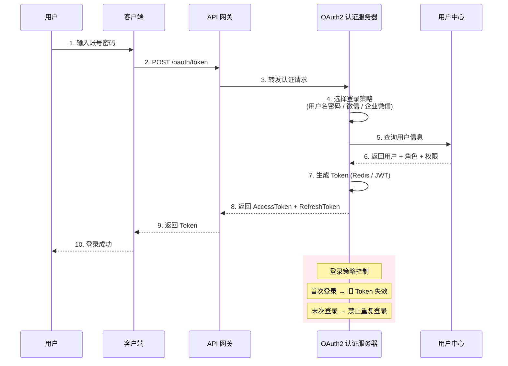
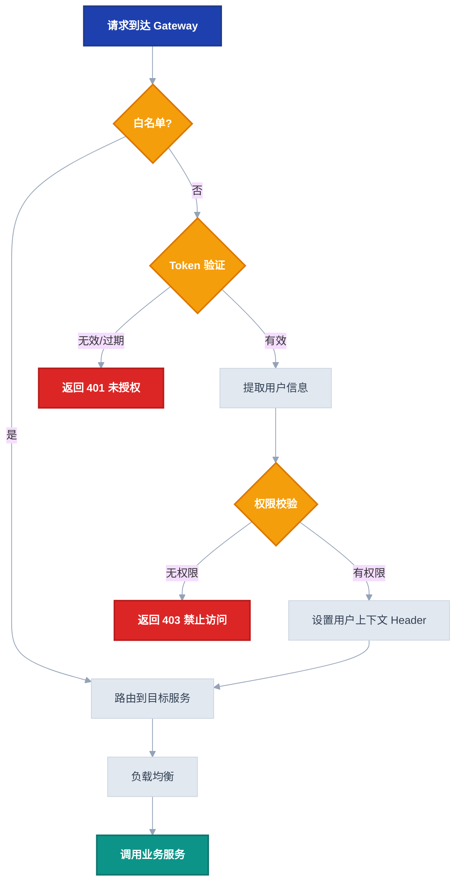
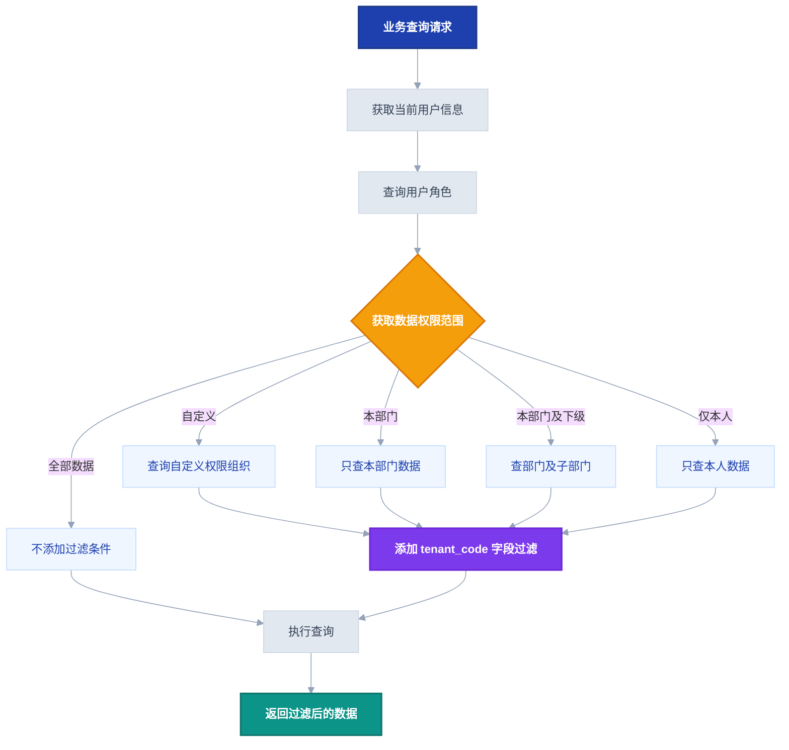

# 业务流程图

本章通过 Mermaid 流程图展示 Fastsun 框架的核心业务流程，帮助开发者理解系统运行的全貌。

---

## 1. 项目启动流程

服务启动时，框架自动完成以下初始化工作：



---

## 2. 首次请求全流程

从客户端发起到响应的完整请求链路：



---

## 3. WebSocket 连接流程

实时消息推送的连接建立过程：



---

## 4. 消息推送流程

业务系统触发消息推送的完整链路：

```mermaid
%%{init: {'theme': 'base', 'themeVariables': {'fontSize': '14px', 'lineColor': '#94a3b8'}}}%%
flowchart LR
    Trigger[业务触发<br/>订单/审批/通知] --> Channel{消息渠道}
    Channel -->|WebSocket| WS[WebSocket 实时推送]
    Channel -->|短信| SMS[阿里云/腾讯云 短信]
    Channel -->|邮件| Email[SMTP 邮件发送]
    Channel -->|站内信| Internal[站内消息]

    WS -->|查找在线用户| Redis1[Redis 订阅关系]
    WS -->|推送到前端| Client1[在线用户]
    SMS -->|调用云 API| SmsProvider[短信平台]
    Email -->|渲染模板| Tpl[邮件模板]
    Email -->|发送| Smtp[SMTP 服务器]
    Internal -->|存入数据库| InternalDB[(站内信表)]

    subgraph 消息模板引擎
        Template[消息模板] --> Render[参数渲染<br/>${orderNo}]
        Render --> WS
        Render --> SMS
        Render --> Email
        Render --> Internal
    end

    classDef source fill:#1e40af,color:#fff,stroke:#1e3a8a,stroke-width:2px,font-weight:bold
    classDef choice fill:#f59e0b,color:#fff,stroke:#d97706,stroke-width:2px,font-weight:bold
    classDef step fill:#e2e8f0,color:#334155,stroke:#cbd5e1,stroke-width:1px
    classDef template fill:#7c3aed,color:#fff,stroke:#6d28d9,stroke-width:2px,font-weight:bold
    classDef dest fill:#0d9488,color:#fff,stroke:#0f766e,stroke-width:2px,font-weight:bold

    class Trigger source
    class Channel choice
    class WS,SMS,Email,Internal,Redis1,SmsProvider,Tpl,Smtp,InternalDB step
    class Template,Render template
    class Client1 dest
```

---

## 5. OAuth2 登录认证流程



---

## 6. 网关鉴权路由流程



---

## 7. 数据权限过滤流程



---

## 相关文档

- [架构概览](./架构概览.md)
- [多租户架构](./多租户架构.md)
- [安全架构](./安全架构.md)
- [配置项大全](../configuration/配置项大全.md)
