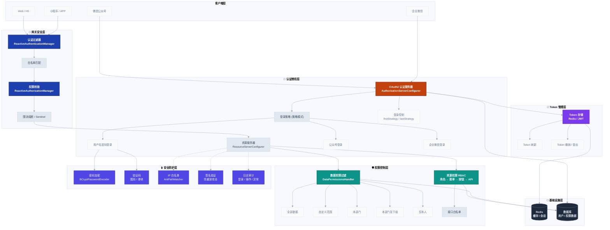

# 安全架构详解

## 概述

Fastsun 平台基于 OAuth2 + Spring Security 构建完整的安全体系，提供认证、授权、权限控制等安全功能。

## 安全架构总览



> 💡 **认证、授权、网关鉴权等交互流程请参见 [业务流程图](./业务流程图.md) 中的「OAuth2 登录认证流程」「网关鉴权路由流程」「数据权限过滤流程」**

## 认证架构

### 认证服务器配置

```java
// AuthorizationServerConfigurer.java
@Configuration
@EnableAuthorizationServer
public class AuthorizationServerConfigurer extends AuthorizationServerConfigurerAdapter {
    
    @Override
    public void configure(ClientDetailsServiceConfigurer clients) throws Exception {
        clients.inMemory()
            .withClient("fastsun")
            .secret(passwordEncoder.encode("fastsun"))
            .authorizedGrantTypes("password", "refresh_token", "authorization_code")
            .scopes("all")
            .accessTokenValiditySeconds(7200)
            .refreshTokenValiditySeconds(2592000);
    }
    
    @Override
    public void configure(AuthorizationServerEndpointsConfigurer endpoints) {
        endpoints
            .authenticationManager(authenticationManager)
            .tokenStore(tokenStore)
            .userDetailsService(userDetailsService);
    }
}
```

### 资源服务器配置

```java
// ResourceServerConfigurer.java
@Configuration
@EnableResourceServer
public class ResourceServerConfigurer extends ResourceServerConfigurerAdapter {
    
    @Override
    public void configure(HttpSecurity http) throws Exception {
        http
            .authorizeRequests()
            .antMatchers("/public/**").permitAll()
            .anyRequest().authenticated();
    }
}
```

## 登录方式

Fastsun 支持多种登录方式，采用策略模式实现：

### 1. 用户名密码登录

```java
// UsernamePasswordAuthenticator.java
@Component
public class UsernamePasswordAuthenticator extends AbstractPreparableIntegrationAuthenticator {
    
    @Override
    protected UserDTO findUserInfo(IntegrationAuthentication auth, Application app) {
        String username = auth.getAuthParameter("username");
        String password = auth.getAuthParameter("password");
        
        // 验证码校验
        checkCaptcha(auth);
        
        // 查询用户
        UserDTO user = userService.findByUsername(username);
        
        // 密码校验
        if (!passwordEncoder.matches(password, user.getPassword())) {
            throw new BusinessException("用户名或密码错误");
        }
        
        return user;
    }
}
```

### 2. 微信公众号登录

```java
// WechatMpAuthenticator.java
@Component
public class WechatMpAuthenticator extends AbstractPreparableIntegrationAuthenticator {
    
    @Override
    protected UserDTO findUserInfo(IntegrationAuthentication auth, Application app) {
        String code = auth.getAuthParameter("code");
        
        // 通过 code 换取 openid
        String openid = wechatService.getOpenid(code);
        
        // 根据 openid 查询用户
        UserDTO user = userService.findByOpenid(openid);
        
        return user;
    }
}
```

### 3. 企业微信登录

```java
// WechatCpMobileAuthenticator.java
@Component
public class WechatCpMobileAuthenticator extends AbstractPreparableIntegrationAuthenticator {
    
    @Override
    protected UserDTO findUserInfo(IntegrationAuthentication auth, Application app) {
        String code = auth.getAuthParameter("code");
        String agentId = auth.getAuthParameter("agentId");
        
        // 获取企业微信用户信息
        WechatCpUser cpUser = wechatCpService.getUserInfo(code, agentId);
        
        // 根据手机号查询用户
        UserDTO user = userService.findByMobile(cpUser.getMobile());
        
        return user;
    }
}
```

### 登录策略

系统支持两种登录策略：

**首次登录策略 (firstStrategy)**
- 新登录会使旧 Token 失效
- 保证同一用户只有一个有效会话

**末次登录策略 (lastStrategy)**
- 不允许重复登录
- 如果已登录则抛出异常

```java
// FirstLoginStrategyImpl.java
@Component("firstStrategy")
public class FirstLoginStrategyImpl implements ILoginStrategy {
    
    @Override
    public void execute(String clientId, String username) {
        Collection<OAuth2AccessToken> tokens = 
            tokenStore.findTokensByClientIdAndUserName(clientId, username);
        
        if (!CollectionUtils.isEmpty(tokens)) {
            // 撤销旧 Token
            tokens.forEach(token -> consumerTokenServices.revokeToken(token.getValue()));
        }
    }
}
```

## 授权机制

### 资源权限

基于角色的访问控制 (RBAC)：

```
用户 → 角色 → 资源 (菜单/按钮/API)
```

**权限拦截器**
```java
// ResourcePermissionInterceptor.java
public class ResourcePermissionInterceptor implements HandlerInterceptor {
    
    @Override
    public boolean preHandle(HttpServletRequest request, 
                            HttpServletResponse response, 
                            Object handler) {
        UserDTO user = LocalUserContext.get();
        String url = request.getRequestURI();
        String method = request.getMethod();
        
        // 检查用户是否有访问该资源的权限
        boolean hasPermission = permissionService.checkPermission(
            user.getId(), url, method);
        
        if (!hasPermission) {
            throw new AccessDeniedException("没有访问权限");
        }
        
        return true;
    }
}
```

### 数据权限

基于用户、角色、组织的数据过滤：

```java
// DataPermissionsHandler.java
@Component
public class DataPermissionsHandler {
    
    public QueryParameter handleDataPermission(QueryParameter query) {
        UserDTO user = LocalUserContext.get();
        
        // 获取用户的数据权限范围
        DataScope scope = getDataScope(user);
        
        switch (scope.getType()) {
            case ALL:
                // 全部数据权限
                break;
            case CUSTOM:
                // 自定义数据权限
                addCustomCondition(query, scope);
                break;
            case DEPT:
                // 本部门数据权限
                addDeptCondition(query, user.getDeptId());
                break;
            case DEPT_AND_CHILD:
                // 本部门及下级部门数据权限
                addDeptAndChildCondition(query, user.getDeptId());
                break;
            case SELF:
                // 仅本人数据权限
                addSelfCondition(query, user.getId());
                break;
        }
        
        return query;
    }
}
```

### 接口权限

基于 URL 的访问控制：

```yaml
# 白名单配置
fastsun:
  platform:
    security:
      white-list:
        - /public/**
        - /login
        - /captcha
        - /swagger-ui/**
        - /v3/api-docs/**
```

## Token 管理

### Token 存储

支持多种 Token 存储方式：

**Redis Token Store**
```java
@Bean
public TokenStore tokenStore(RedisConnectionFactory connectionFactory) {
    RedisTokenStore tokenStore = new RedisTokenStore(connectionFactory);
    tokenStore.setPrefix("oauth:token:");
    return tokenStore;
}
```

**JWT Token Store**
```java
@Bean
public TokenStore jwtTokenStore() {
    return new JwtTokenStore(accessTokenConverter());
}

@Bean
public JwtAccessTokenConverter accessTokenConverter() {
    JwtAccessTokenConverter converter = new JwtAccessTokenConverter();
    converter.setSigningKey("your-secret-key");
    return converter;
}
```

### Token 刷新

```java
@PostMapping("/oauth/token")
public ResponseEntity<OAuth2AccessToken> refreshToken(
        @RequestParam("refresh_token") String refreshToken) {
    
    OAuth2AccessToken accessToken = tokenServices.refreshAccessToken(
        refreshToken, new HashSet<>());
    
    return ResponseEntity.ok(accessToken);
}
```

## 网关安全

### 认证过滤器

```java
// AuthenticationManager.java
@Component
public class AuthenticationManager implements ReactiveAuthenticationManager {
    
    @Autowired
    private TokenStore tokenStore;
    
    @Override
    public Mono<Authentication> authenticate(Authentication authentication) {
        return Mono.justOrEmpty(authentication)
            .filter(a -> a instanceof BearerTokenAuthenticationToken)
            .cast(BearerTokenAuthenticationToken.class)
            .map(BearerTokenAuthenticationToken::getToken)
            .flatMap(accessToken -> {
                OAuth2AccessToken token = tokenStore.readAccessToken(accessToken);
                if (token == null || token.isExpired()) {
                    return Mono.error(new InvalidBearerTokenException("Token无效或已过期"));
                }
                
                OAuth2Authentication auth = tokenStore.readAuthentication(token);
                return Mono.just(auth);
            });
    }
}
```

### 权限校验

```java
// AuthorizationManager.java
@Component
public class AuthorizationManager implements ReactiveAuthorizationManager {
    
    @Override
    public Mono<AuthorizationDecision> check(Mono<Authentication> authentication,
                                             ServerWebExchange exchange) {
        return authentication
            .map(auth -> {
                String path = exchange.getRequest().getURI().getPath();
                String method = exchange.getRequest().getMethodValue();
                
                // 检查权限
                boolean hasPermission = checkPermission(auth, path, method);
                
                return new AuthorizationDecision(hasPermission);
            })
            .defaultIfEmpty(new AuthorizationDecision(false));
    }
}
```

## 安全防护

### 1. 密码加密

使用 BCrypt PasswordEncoder：

```java
@Bean
public PasswordEncoder passwordEncoder() {
    return new BCryptPasswordEncoder();
}

// 加密密码
String encodedPassword = passwordEncoder.encode(rawPassword);

// 校验密码
boolean matches = passwordEncoder.matches(rawPassword, encodedPassword);
```

### 2. 验证码

支持图形验证码和滑块验证码：

```java
// 生成验证码
Captcha captcha = captchaService.generate();
String captchaId = captcha.getId();
String captchaCode = captcha.getCode();

// 校验验证码
boolean valid = captchaService.verify(captchaId, inputCode);
```

### 3. IP 白名单

```java
// IpWhiteUtil.java
public class IpWhiteUtil {
    
    public static boolean isInWhiteList(String ip, List<String> whiteList) {
        if (CollectionUtils.isEmpty(whiteList)) {
            return false;
        }
        
        return whiteList.stream()
            .anyMatch(pattern -> AntPathMatcher.match(pattern, ip));
    }
}
```

### 4. 签名验证

```java
// SignatureConfigurer.java
@Data
public class SignatureConfigurer {
    private boolean enabled;
    private String secretKey;
    private List<String> excludeUrls;
}

// 签名验证拦截器
public boolean verifySignature(HttpServletRequest request) {
    String timestamp = request.getHeader("X-Timestamp");
    String nonce = request.getHeader("X-Nonce");
    String signature = request.getHeader("X-Signature");
    
    // 验证时间戳（防止重放攻击）
    long currentTime = System.currentTimeMillis();
    if (Math.abs(currentTime - Long.parseLong(timestamp)) > 300000) {
        return false;
    }
    
    // 验证签名
    String expectedSignature = generateSignature(timestamp, nonce, secretKey);
    return Objects.equals(signature, expectedSignature);
}
```

## 最佳实践

### 1. Token 安全
- 使用 HTTPS 传输 Token
- 设置合理的 Token 过期时间
- 实现 Token 刷新机制
- 敏感操作需要重新认证

### 2. 密码安全
- 使用强密码策略
- 定期更换密码
- 密码不能明文存储
- 限制密码重试次数

### 3. 权限最小化
- 默认拒绝所有请求
- 只开放必要的权限
- 定期审查权限配置
- 及时回收离职人员权限

### 4. 日志审计
- 记录登录日志
- 记录操作日志
- 记录异常日志
- 定期审计日志

## 常见问题

### Q1: 如何实现单点登录 (SSO)?

使用 OAuth2 的授权码模式：
1. 应用 A 重定向用户到认证服务器
2. 用户登录后获得授权码
3. 应用 A 用授权码换取 Token
4. 应用 B 可以使用相同的 Token

### Q2: 如何处理 Token 泄露?

1. 立即撤销泄露的 Token
2. 强制用户重新登录
3. 记录安全事件
4. 分析泄露原因

### Q3: 如何实现细粒度权限控制?

使用数据权限 + 资源权限组合：
- 资源权限控制能否访问某个 API
- 数据权限控制能看到哪些数据

## 相关文档

- [架构概览](./架构概览.md)
- [多租户架构](./多租户架构.md)
- [业务流程图](./业务流程图.md)
