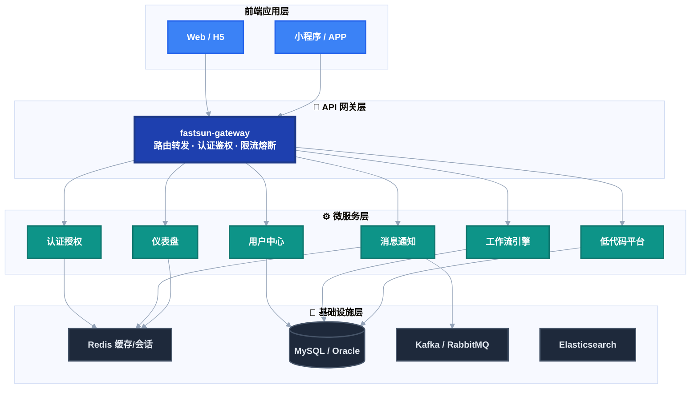
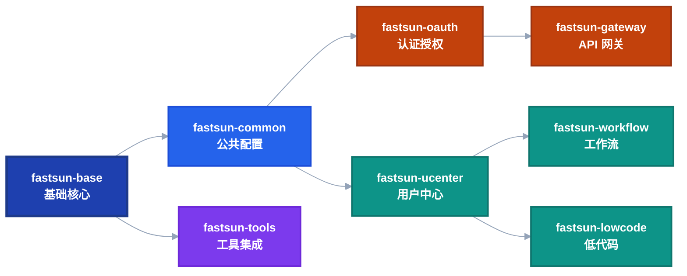

# Fastsun 平台架构概述

## 整体架构

Fastsun 平台采用微服务架构，基于 Spring Boot 和 Spring Cloud 构建，支持多租户隔离。整体架构分为以下几个层次：





## 核心模块

### 1. fastsun-base
基础核心模块，提供：
- 通用工具类
- 基础注解
- 统一响应封装
- 异常处理
- 数据权限拦截器

### 2. fastsun-common
公共配置模块，提供：
- 系统初始化器
- 白名单配置
- 多租户配置
- 全局过滤器

### 3. fastsun-ucenter
用户中心模块，包含：
- 用户管理
- 组织架构
- 角色权限
- 租户管理

### 4. fastsun-oauth
认证授权模块，提供：
- OAuth2 认证服务器
- 资源服务器
- 多种登录方式
- Token 管理

### 5. fastsun-workflow
工作流模块，基于 Activiti：
- 流程设计器
- 流程引擎
- 任务管理
- 流程监控

### 6. fastsun-lowcode
低代码平台模块：
- 动态表单
- 视图配置
- 代码生成
- 模型管理

### 7. fastsun-message
消息通知模块：
- WebSocket 推送
- 短信发送
- 邮件发送
- 消息模板

### 8. fastsun-dashboard
仪表盘模块：
- 组件管理
- 布局配置
- 数据可视化

### 9. fastsun-tools
工具集成模块：
- Redis 集成
- Kafka 集成
- RabbitMQ 集成
- MongoDB 集成
- Elasticsearch 集成

## 多租户架构

Fastsun 支持两种多租户隔离模式：

### 字段隔离模式
- 所有租户共享同一数据库
- 通过 `tenant_code` 字段区分不同租户
- 通过 Hibernate 拦截器自动添加租户条件

**优点**：
- 部署简单
- 维护成本低
- 资源共享

**缺点**：
- 数据隔离性相对较弱
- 性能受租户数量影响

### 数据库隔离模式
- 每个租户拥有独立的数据库
- 通过 `MultiTenantConnectionProvider` 动态切换数据源
- 完全的数据隔离

**优点**：
- 数据隔离性强
- 性能独立
- 便于备份恢复

**缺点**：
- 部署复杂
- 维护成本高
- 资源占用多

## 安全架构

### 认证流程
```
客户端 → Gateway → OAuth2 Authorization Server → Resource Server
         ↓              ↓                            ↓
      白名单检查    身份验证                      权限校验
```

### 权限控制
1. **资源权限**: 基于角色的访问控制 (RBAC)
2. **数据权限**: 基于用户、角色、组织的数据过滤
3. **接口权限**: 基于 URL 的访问控制

## 技术特点

### 1. 模块化设计
- 每个功能模块独立打包
- 按需引入依赖
- 便于扩展和维护

### 2. 可扩展性
- SPI 机制支持自定义扩展
- 事件驱动架构
- 插件化设计

### 3. 高性能
- Redis 缓存优化
- 异步处理
- 连接池管理

### 4. 高可用
- 服务注册发现 (Nacos)
- 负载均衡
- 熔断降级 (Sentinel)

## 部署架构

### 单体部署
适用于小型项目或开发环境：
- 所有模块打包为一个应用
- 单一数据库
- 简单部署

### 微服务部署
适用于大型项目或生产环境：
- 各模块独立部署
- 服务网格
- 分布式数据库

## 下一步

- 深入了解 [多租户架构](./multi-tenancy.md)
- 了解 [安全架构](./security.md)
- 查看 [微服务架构](./microservices.md)
